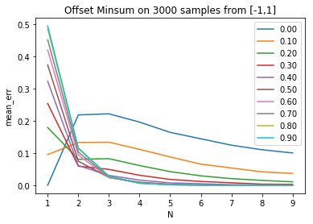
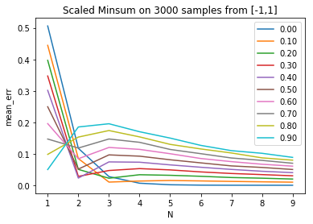
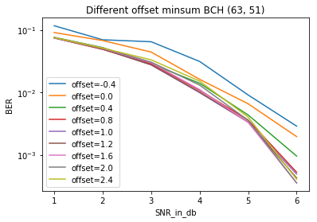

# Min-Sum-Approx
In belief propagation of channel decoding, the form of min-sum approximation with offet is usually proven equivalent in the case of two dimensional input. However, people simply generalize it into the high-dimension form. This project is to study the min-sum approximation error in the case of high dimensional input. 

## Observation
These simulation results turn out that the optimal min-sum approximation highly depends on the input value range and input dimension. In the case of scalar input, min-sum approximation is equivalent to the original function. **With higher dimensional input, different offset settings all converge to zeros.** This is because tanh falls into [-1,1] and arctanh over the product of multiple tanh results tends to produce zero output. 

Here are two simulation results with input range [-1,1]. The **offset min-sum approximation** with offset 0.5 looks a good choice to balence between different input dimensions. Ironically, the **scaled min-sum approximation** with scaling factor 0 is generally good when input dimension is larger than 4. 




Moreover, a simple evaluation is performed over BCH (63, 51) from https://www.uni-kl.de/channel-codes. Note that in practical decoding, the simulated optimal offset setting doesn't look like a good choice. Instead, offset as large as 2.0 can achieve good performance in this case. `Such phenomenon requires further investigation not only into the approximation error but also the loopy belief propagation convergence.`



## Reproduce
* Check out the `jupyter/minsumapprox.ipynb` to see the simulated approximation error. 
* Execute the `run.sh` and use `jupyter/bch_63_51.ipynb` to see the BCH (63, 51) results. 

## Usage
This project provides a flooding implementation of belief propagation for channel decoding. Feel free to investigate into other linear block codes. 
```console
~/Min-Sum-Approx$ python bp.py --help
usage: Belief Propagation Decoder [-h] [--B B] [--F F] [--G G] [--H H] [--K K]
                                  [--N N] [--T T] [--X X] [--Y Y]
                                  [--s_snr S_SNR] [--e_snr E_SNR]
                                  [--step STEP] [--offset OFFSET]
                                  [--seed SEED]

optional arguments:
  -h, --help       show this help message and exit
  --B B            Batch size
  --F F            Functions to select
  --G G            Generator matrix
  --H H            Parity Check matrix
  --K K            Message length
  --N N            Code length
  --T T            Iterations
  --X X            Maximum number of test
  --Y Y            Least number of error frame
  --s_snr S_SNR    SNR start value in dB
  --e_snr E_SNR    SNR end value in dB
  --step STEP      SNR step in dB
  --offset OFFSET  Offset min sum value
  --seed SEED      Random seed
```

## Contributing
Pull requests are welcome if you want to extend new features or experimental results. For major changes, please discuss first in issue and we can decide together how to work on it. 

[](https://996.icu) [](https://github.com/996icu/996.ICU/blob/master/LICENSE) 

